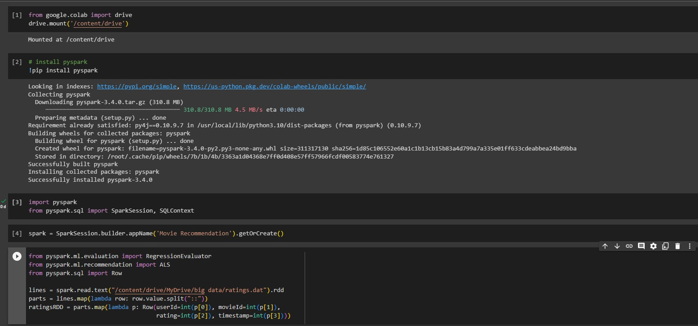
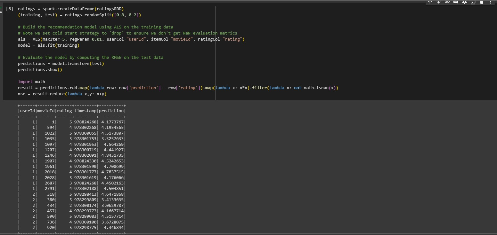
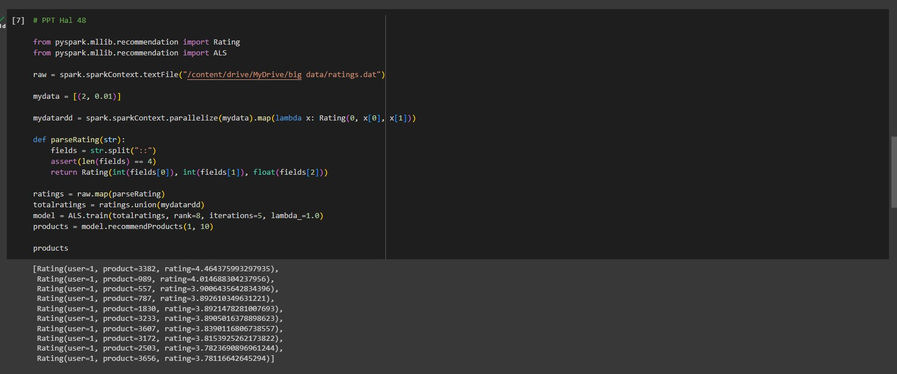
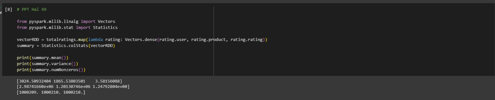
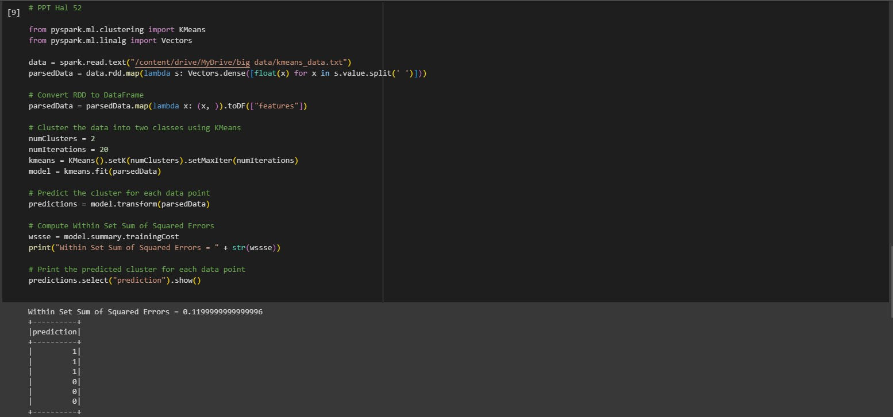
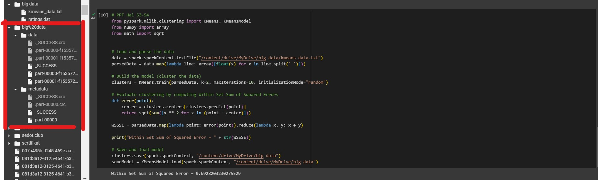

# SPARK MACHINE LEARNING

Nama   : Annisa Aulia Nadhila

Kelas  : TI - 3C

NIM  : 2041720023
#

## PENJELASAN

1.  fungsi `drive.mount('/content/drive')` adalah untuk mengimpor modul drive dari paket google.colab dan menggunakan fungsi mount untuk menghubungkan dan memasang Google Drive pada sesi Colab.

2. Dengan menjalankan perintah `!pip install pyspark`, kita menginstal modul pyspark ke dalam lingkungan Python yang kita gunakan. Setelah instalasi selesai, kita dapat mengimpor dan menggunakan modul tersebut dalam skrip Python kita untuk melakukan operasi data yang kompleks dan memanfaatkan fitur-fitur Apache Spark.

3. Kode `import pyspark
from pyspark.sql import SparkSession, SQLContext`
 di atas digunakan untuk mengimpor modul Pyspark dan mengambil kelas SparkSession dan SQLContext dari modul Pyspark.sql.

4. Kode `spark = SparkSession.builder.appName('Movie Recommendation').getOrCreate()
` di atas merupakan contoh penggunaan Apache Spark untuk membuat sesi Spark yang diberi nama 'Movie Recommendation'.

5. Berikut adalah penjelasan singkat untuk setiap bagian kode:

- Import modul yang diperlukan:
   - `from pyspark.ml.evaluation import RegressionEvaluator`: Modul ini digunakan untuk melakukan evaluasi regresi pada model yang dibangun.
   - `from pyspark.ml.recommendation import ALS`: Modul ini digunakan untuk membangun sistem rekomendasi berdasarkan metode Alternating Least Squares (ALS).
   - `from pyspark.sql import Row`: Modul ini digunakan untuk mengubah baris data menjadi objek Row dalam DataFrame.

- Membaca file teks:
   - `lines = spark.read.text("/content/drive/MyDrive/big data/ratings.dat").rdd`: Kode ini membaca file teks dari lokasi "/content/drive/MyDrive/big data/ratings.dat" menggunakan objek `spark` yang diasumsikan sebagai sesi Spark. Metode `.rdd` digunakan untuk mengubah DataFrame menjadi Resilient Distributed Dataset (RDD), yang memungkinkan pemrosesan data yang terdistribusi.

- Memisahkan data:
   - `parts = lines.map(lambda row: row.value.split("::"))`: Kode ini memisahkan setiap baris data dengan delimiter "::" menggunakan fungsi `split`. `lines` adalah RDD yang berisi baris-baris data dari file teks. Metode `.map` digunakan untuk menerapkan operasi pemisahan pada setiap baris.

- Membuat RDD ratings:
   - `ratingsRDD = parts.map(lambda p: Row(userId=int(p[0]), movieId=int(p[1]), rating=int(p[2]), timestamp=int(p[3])))`: Kode ini mengubah setiap baris data yang telah dipisahkan menjadi objek `Row` dalam RDD `ratingsRDD`. Data tersebut juga diubah menjadi tipe data yang sesuai (misalnya, integer) dengan menggunakan fungsi `int()`.

Kode di atas adalah contoh penggunaan Apache Spark untuk membangun dan menguji model rekomendasi menggunakan metode ALS (Alternating Least Squares) pada data rating film. Berikut adalah penjelasan singkat mengenai setiap langkah:

- `ratings = spark.createDataFrame(ratingsRDD)`: Membuat DataFrame dari RDD (Resilient Distributed Dataset) yang berisi data rating film. `ratingsRDD` merupakan RDD yang berisi baris-baris rating film.

- `(training, test) = ratings.randomSplit([0.8, 0.2])`: Membagi data rating menjadi dua subset, yaitu `training` (80% data) dan `test` (20% data), secara acak.

- `als = ALS(maxIter=5, regParam=0.01, userCol="userId", itemCol="movieId", ratingCol="rating")`: Membangun objek ALS (Alternating Least Squares) dengan konfigurasi tertentu, termasuk jumlah iterasi maksimum (maxIter), parameter regularisasi (regParam), serta kolom-kolom yang mengidentifikasi pengguna (userCol), item (itemCol), dan rating (ratingCol).

- `model = als.fit(training)`: Melatih model ALS menggunakan data training yang telah dibuat sebelumnya.

- `predictions = model.transform(test)`: Menghasilkan prediksi rating film untuk data test menggunakan model yang telah dilatih.

- `predictions.show()`: Menampilkan beberapa baris prediksi rating film pada data test.

- `import math`: Mengimpor modul matematika.

- `result = predictions.rdd.map(lambda row: row['prediction'] - row['rating']).map(lambda x: x*x).filter(lambda x: not math.isnan(x))`: Menghitung perbedaan antara prediksi rating dan rating aktual untuk setiap baris dalam DataFrame `predictions`. Kemudian, hasil perhitungan tersebut dijadikan RDD, dipangkatkan dua, dan dihapuskan nilai yang tidak terdefinisi (NaN).

- `mse = result.reduce(lambda x,y: x+y)`: Menjumlahkan semua nilai dalam RDD `result` untuk mendapatkan nilai Mean Squared Error (MSE), yang digunakan untuk mengevaluasi kualitas prediksi model.

Secara keseluruhan, kode tersebut memuat langkah-langkah untuk membangun model rekomendasi menggunakan ALS dengan Apache Spark, serta mengevaluasi model tersebut dengan menghitung MSE pada data test.

Kode tersebut adalah contoh implementasi menggunakan PySpark untuk sistem rekomendasi berdasarkan Collaborative Filtering dengan metode Alternating Least Squares (ALS). Berikut adalah penjelasan singkat untuk setiap bagian kode tersebut:

- Impor modul yang diperlukan:
   - `Rating` dari `pyspark.mllib.recommendation`: Digunakan untuk merepresentasikan data rating.
   - `ALS` dari `pyspark.mllib.recommendation`: Digunakan untuk melatih model rekomendasi dengan metode ALS.

- Membaca data dari file:
   - `raw` akan berisi data yang dibaca dari file "ratings.dat" menggunakan `textFile` dari `sparkContext` pada `spark`.
   
- Membuat data tambahan:
   - `mydata` berisi data tambahan yang ingin ditambahkan ke dataset, dalam contoh ini adalah `(2, 0.01)`.
   - `mydatardd` adalah RDD (Resilient Distributed Dataset) yang dibuat dari `mydata`. RDD ini akan digunakan sebagai data tambahan untuk melatih model.

- Mendefinisikan fungsi `parseRating`:
   - Fungsi ini digunakan untuk mengubah data rating dalam format string menjadi objek `Rating`.
   - Data rating dalam format string dipisahkan menggunakan "::" dan diubah menjadi objek `Rating`.
   - Fungsi ini kemudian digunakan pada RDD `raw` menggunakan `map` untuk mengubah semua data rating menjadi objek `Rating`.

- Menggabungkan data rating dan data tambahan:
   - Data rating dari RDD `raw` dan data tambahan dari RDD `mydatardd` digabungkan menggunakan `union` dan disimpan pada variabel `totalratings`.
   - Data ini akan digunakan sebagai input untuk melatih model ALS.

- Melatih model ALS:
   - Model ALS dilatih menggunakan metode `ALS.train` dengan parameter sebagai berikut:
     - `totalratings`: Data rating yang akan digunakan untuk melatih model.
     - `rank=8`: Jumlah faktor latennya adalah 8.
     - `iterations=5`: Jumlah iterasi yang digunakan dalam pelatihan model.
     - `lambda_=1.0`: Parameter regulasi untuk mengendalikan kompleksitas model.

- Merekomendasikan produk:
   - Model yang sudah dilatih digunakan untuk merekomendasikan 10 produk untuk pengguna dengan ID 1 menggunakan metode `recommendProducts`.
   - Hasil rekomendasi disimpan pada variabel `products`.

- Mengembalikan hasil rekomendasi:
   - Hasil rekomendasi produk dikembalikan sebagai output dari kode tersebut.

Kode di atas menggunakan PySpark untuk melakukan analisis statistik pada suatu dataset. Berikut adalah penjelasan singkat untuk setiap baris kode:

- `from pyspark.mllib.linalg import Vectors` - Mengimpor modul Vectors dari library `pyspark.mllib.linalg`. Modul ini menyediakan kelas Vectors untuk mengoperasikan vektor dan matriks dalam Spark.

- `from pyspark.mllib.stat import Statistics` - Mengimpor modul Statistics dari library `pyspark.mllib.stat`. Modul ini menyediakan fungsi-fungsi statistik untuk melakukan analisis statistik pada data di Spark.

- `vectorRDD = totalratings.map(lambda rating: Vectors.dense(rating.user, rating.product, rating.rating))` - Membuat RDD (Resilient Distributed Dataset) baru dengan nama `vectorRDD`. RDD ini berisi vektor yang dibentuk dari atribut-atribut `user`, `product`, dan `rating` dari setiap objek `rating` dalam RDD `totalratings`.

- `summary = Statistics.colStats(vectorRDD)` - Menghitung statistik ringkasan dari RDD `vectorRDD` menggunakan fungsi `colStats` dari modul `Statistics`. Hasilnya disimpan dalam variabel `summary`.

- `print(summary.mean())` - Mencetak nilai rata-rata dari setiap atribut dalam RDD `vectorRDD` menggunakan metode `mean()` dari objek `summary`.

- `print(summary.variance())` - Mencetak nilai varians dari setiap atribut dalam RDD `vectorRDD` menggunakan metode `variance()` dari objek `summary`.

- `print(summary.numNonzeros())` - Mencetak jumlah elemen non-nol dari setiap atribut dalam RDD `vectorRDD` menggunakan metode `numNonzeros()` dari objek `summary`.

Dengan demikian, kode di atas digunakan untuk menghitung statistik ringkasan seperti rata-rata, varians, dan jumlah elemen non-nol dari atribut-atribut dalam RDD `totalratings`.

Kode tersebut adalah contoh implementasi algoritma K-Means clustering menggunakan library PySpark. Berikut adalah penjelasan singkatnya:

- Impor library yang diperlukan:
   - `from pyspark.ml.clustering import KMeans` untuk mengimport kelas KMeans dari modul `pyspark.ml.clustering`.
   - `from pyspark.ml.linalg import Vectors` untuk mengimport kelas Vectors dari modul `pyspark.ml.linalg`.

- Membaca data dari file:
   - `data = spark.read.text("/content/drive/MyDrive/big data/kmeans_data.txt")` membaca data dari file teks yang berisi titik-titik data dalam format yang sesuai.

- Mengubah data menjadi bentuk vektor:
   - `parsedData = data.rdd.map(lambda s: Vectors.dense([float(x) for x in s.value.split(' ')]))` mengubah setiap baris data menjadi vektor dengan memisahkan nilai-nilai pada setiap baris dengan spasi.

- Mengonversi RDD menjadi DataFrame:
   - `parsedData = parsedData.map(lambda x: (x, )).toDF(["features"])` mengubah RDD ke dalam bentuk DataFrame dengan kolom "features" yang berisi vektor-vektor data.

- Melakukan clustering menggunakan algoritma K-Means:
   - `numClusters = 2` menentukan jumlah kluster yang diinginkan.
   - `numIterations = 20` menentukan jumlah iterasi yang akan dilakukan dalam algoritma K-Means.
   - `kmeans = KMeans().setK(numClusters).setMaxIter(numIterations)` membuat objek KMeans dengan jumlah kluster dan iterasi yang ditentukan.
   - `model = kmeans.fit(parsedData)` melakukan pemodelan clustering terhadap data yang telah diproses sebelumnya.

- Memprediksi kluster untuk setiap data:
   - `predictions = model.transform(parsedData)` memprediksi kluster untuk setiap data dengan menggunakan model yang telah dilatih.

- Menghitung Within Set Sum of Squared Errors (WSSSE):
   - `wssse = model.summary.trainingCost` menghitung WSSSE dari model yang telah dilatih.
   - `print("Within Set Sum of Squared Errors = " + str(wssse))` mencetak hasil WSSSE.

- Mencetak kluster yang diprediksi untuk setiap data:
   - `predictions.select("prediction").show()` mencetak kolom "prediction" yang berisi kluster yang diprediksi untuk setiap data.

Kode di atas merupakan contoh implementasi algoritma K-Means clustering menggunakan Apache Spark's PySpark library. Berikut adalah penjelasan singkat dari setiap bagian kode:

- Mengimpor modul yang diperlukan:
   - `KMeans` dan `KMeansModel` dari `pyspark.mllib.clustering` untuk melakukan K-Means clustering.
   - `array` dari `numpy` untuk mengubah data menjadi array.
   - `sqrt` dari `math` untuk menghitung akar kuadrat.

- Memuat dan memparsing data:
   - Data dimuat dari file teks menggunakan `sparkContext.textFile`.
   - Setiap baris data diparsing menjadi array angka menggunakan `map` dan `split`.

- Membangun model K-Means:
   - `KMeans.train` digunakan untuk membangun model dengan parameter yang diberikan, seperti jumlah klaster (k), iterasi maksimum, dan mode inisialisasi.

- Evaluasi clustering dengan menghitung Within Set Sum of Squared Errors (WSSSE):
   - `error` adalah sebuah fungsi yang menghitung jarak antara sebuah titik dengan pusat klaster terdekat.
   - `parsedData` di-map menggunakan `error` untuk menghitung error pada setiap titik.
   - Error-error tersebut di-reduce dengan menjumlahkannya untuk mendapatkan WSSSE.

- Menyimpan dan memuat model:
   - Model klaster yang telah dibangun disimpan menggunakan `save` dengan menyediakan path file tujuan.
   - Model yang sama dapat dimuat kembali menggunakan `load` dengan menyediakan path file yang sesuai.

- Mencetak Within Set Sum of Squared Error:
   - Hasil WSSSE yang telah dihitung sebelumnya dicetak menggunakan `print`.

Kode tersebut mengilustrasikan langkah-langkah umum dalam menggunakan algoritma K-Means clustering dengan PySpark untuk membangun model, menghitung evaluasi clustering, serta menyimpan dan memuat model yang telah dibangun.